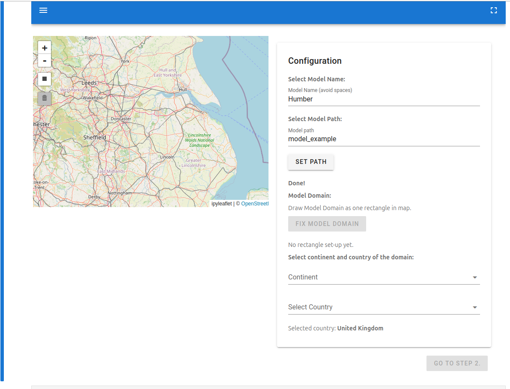

This page provides instructions for installing the project environment and running the notebooks locally on your machine (or on a remote server that you have access to). We also offer a cloud-based environment on D4SCIENCE where you can run the notebooks without any local installation. Please check our [D4SCIENCE guide](d4science.qmd) for more details on the D4SCIENCE environment and how to access it.

This project uses [Pixi](https://pixi.prefix.dev) to manage dependencies. Install Pixi first, then install the project environment.

## Install Pixi

### Linux & macOS

```bash
curl -fsSL https://pixi.sh/install.sh | sh
```

Or with `wget` if `curl` is unavailable:

```bash
wget -qO- https://pixi.sh/install.sh | sh
```

### Windows

```powershell
powershell -ExecutionPolicy Bypass -c "irm -useb https://pixi.sh/install.ps1 | iex"
```

Alternatively, use a package manager:

```powershell
winget install prefix-dev.pixi
# or
scoop install main/pixi
```

### macOS (Homebrew)

```bash
brew install pixi
```

The installer places the `pixi` binary in `~/.pixi/bin` (Linux/macOS) or `%UserProfile%\.pixi\bin` (Windows) and updates your `PATH` automatically. Restart your shell afterwards.

## Install the project environment

Clone the repository and install:

```bash
git clone https://github.com/Deltares-research/iriscc.git
cd iriscc
pixi install
```

Pixi resolves the environment from `pyproject.toml` and `pixi.lock` for a fully reproducible setup.

## Register the Jupyter kernel

To make the Pixi environment available as a kernel in JupyterLab, register it once after installation:

```bash
pixi run python -m ipykernel install --user --name iriscc --display-name "Python (iriscc)"
```

After refreshing JupyterLab, `Python (iriscc)` will appear in the kernel selector. Select it when opening any of the notebooks to ensure all packages are available.

## Running a notebook

Start a notebook directly using Pixi, for example:

```bash
pixi run jupyter notebook FIAT/solara/IRISCC_solara_widget_FIAT.ipynb
```

This will launch Jupyter Notebook with the FIAT widget notebook and opens it in your default web browser. Next, run the notebook cells and scroll down to the FIAT widget. You can select the model name, path, domain, continent and country to run a flood risk assessment. Your screen should look similar to the image below.

{fig-alt="FIAT notebook interface showing a map of the Humber region alongside a configuration panel for selecting model name, path, domain, continent and country."}

You have now successfully installed the project environment and run a notebook. To learn more about the available notebooks and how to use them, please check the [Quickstart guide](quickstart.qmd).

